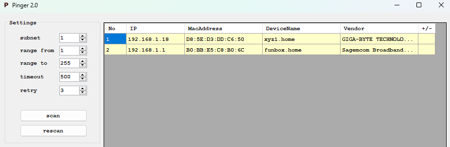
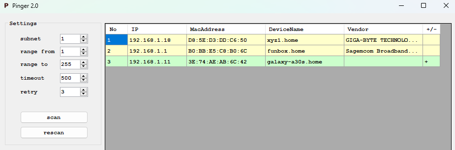
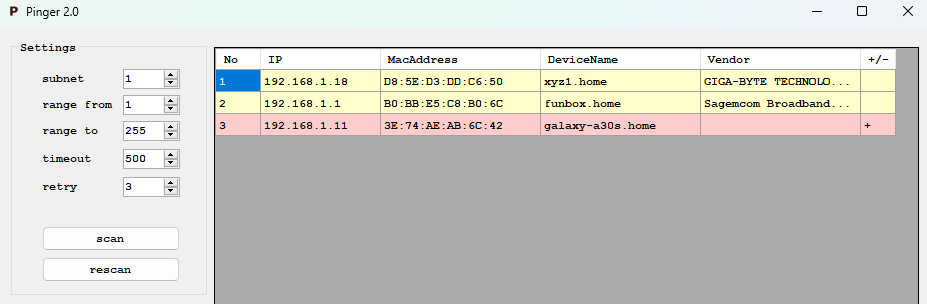

# Pinger ver 2.0
_My application used to discover devices on the network_

# Working - in brief
Run Pinger2.exe
 - Click "scan" to first scan network.
 - Click "rescan" to next scan network. Rescanning allows you to detect differences from the previous one.

# Download
Click [link](https://github.com/lukmasko/Pinger2/raw/main/Pinger_v2_x64.zip) to download executable version.

# Screen
First scan

Second scan with finded new position

Second scan with lost once position

# Technology stack
 C#

# Dependencies
ArpLookup from NuGet (https://github.com/georg-jung/ArpLookup)
    
# Authors
Łukasz Maśko (lukmasko@gmail.com)

# License
...